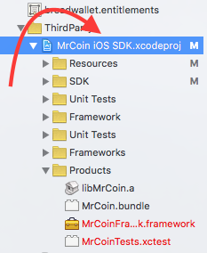
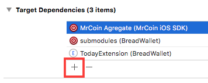
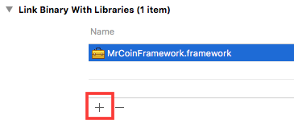
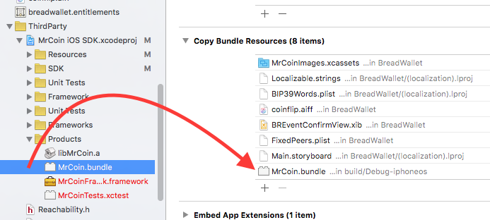

# MrCoin iOS SDK #
This open-source library allows you to integrate MrCoin API services into your iOS app.

## Getting Started ##

### Installation with CocoaPods###

CocoaPods is a dependency manager for Objective-C, which automates and simplifies the process of using 3rd-party libraries like MrCoin SDK in your projects. 

**Podfile**

	platform :ios, '7.0'
	pod "MrCoinSDK"

To use the MrCoin classes within your application, simply include the core framework header using the following:

**ObjC**

    #import <MrCoinFramework/MrCoinFramework.h>

**Swift**

    import MrCoinFramework

to pull it in.

####Alternatively: Adding as a framework (module)####

Xcode 6 and iOS 8 support the use of full frameworks, as does the Mac, which simplifies the process of adding this to your application. 

- To add this to your application, I recommend dragging the **MrCoin iOS SDK.xcodeproj** project file from framework folder into your application's project 

For your application, go to its **target build settings** and choose the **Build Phases** tab. 

- Under the **Target Dependencies** grouping, add **MrCoin Agregate** Agregate to the list (not MrCoinFramework).

- Under the **Link binary with Libraries** grouping, add **MrCoinFramework.framework** to the list (not MrCoin, which builds the static library).

Finally, under the **Copy bundle Resources** grouping, drag **MrCoin.bundle** to the list from the SDK build folder **MrCoin iOS SDK.xcodeproj/Products**.

This should cause MrCoin to build as a framework. To use the MrCoin classes within your application, simply include the core framework header using the following:

**ObjC**

    #import <MrCoinFramework/MrCoinFramework.h>

Under Xcode 6+, this will also build as a module, which will allow you to use this in Swift projects. When set up as above, you should just need to use 

**Swift**

    import MrCoinFramework

to pull it in.

####Alternatively: Adding the static library to your iOS project####

Note: if you want to use this in a Swift project, you need to use the steps in the "Adding this as a framework" section instead of the following. Swift needs modules for third-party code.

Once you have the latest source code for the framework, it's fairly straightforward to add it to your application. Start by dragging the **MrCoin iOS SDK.xcodeproj** file into your application's Xcode project to embed the framework in your project. Next, go to your application's target and add **MrCoin** as a Target Dependency. Finally, you'll want to drag the **libMrCoin.a** library from the MrCoin SDK framework's Products folder to the Link Binary With Libraries build phase in your application's target.

To use the MrCoin classes within your application, simply include the core framework header using the following:

    #import "MrCoin.h"

Additionally, this is an ARC-enabled framework, so if you want to use this within a manual reference counted application targeting iOS 4.x, you'll need to add -fobjc-arc to your Other Linker Flags as well.

### Setup the SDK ###

First, configure the SDK, somewhere in your application delegate file:

	// Setup your reseller key
    [[MrCoin settings] setResellerKey:@"9b85a53c-88fb-4a56-b4b0-4088153e4b7e"];

Add MrCoin View Controller to your view hierarchy, typically in your root view controller.
    
    MrCoinViewController *viewController = [MrCoin viewController:@"MrCoin"];
    [self.navigationController pushViewController:viewController animated:YES];

### Implementing MrCoin Delegate ###

You need to implement the **MrCoinDelegate** protocol to provide some necessary information to our API. 

Example implementation from our ObjC Example:

	-(NSString *)requestPublicKey
	{
		// NSData -> HEX
	    return [key.compressedPublicKey hex];
	}
	-(NSString *)requestDestinationAddress
	{
		// NSData -> base58Check
	    return BTCBase58CheckStringWithData(key.address);
	}
	-(NSString *)requestPrivateKey
	{
		// NSData -> base58Check
	    return BTCBase58CheckStringWithData(key.privateKey);
	}
	-(NSString *)requestMessageSignature:(NSString *)message privateKey:(NSString *)privateKey
	{
		// NSString -> UTF8 -> SHA256
	    NSData *hashedMessage = BTCSHA256([message dataUsingEncoding:NSUTF8StringEncoding]);

		// NSData -> HEX	    
	    return BTCHexFromData( [key signatureForHash:hashedMessage] );
	}
	
#### Message signature ####
We need a bitcoin message signature of provided message (nonce + request method + request path + post data). The SDK provides a message string for example:

	1444560003321GET/api/v1/authenticate?any=thing

We need to send back a valid bitcoin signature to the API as you see in the following example from our iOS Wallet App:

#### About API HTTP Headers
Authentication is successful if the following headers are present:

**X-Mrcoin-Api-Pubkey** 
Public key used for signing. For HD wallet derivation path please see below.

**X-Mrcoin-Api-Signature** 
Bitcoin message signature of (nonce + request method + request path + post data)

**X-Mrcoin-Api-Nonce** 
Unsigned 63 bit integer

[Read more about API Header Structure & HD Wallet Derivation Path](http://sandbox.mrcoin.eu/api/v1/docs#authentication-dummy-endpoint)

## SDK Architecture##

#### MrCoin Singleton ####

Create new SDK view controllers:

	[MrCoin viewController:@"CurrencySettings"]; 	// MrCoinViewController
	
Setup/reset a quick transfer

	[MrCoin setupQuickTransfer];
	[MrCoin resetQuickTransfer];

Setup a custom bundle file

    // Setup a custom bundle
	[[MrCoin sharedController] setCustomBundle:myBundle];

#### Settings Controller ####

Quick add settings view:

    
    MRCSettingsViewController *viewController = [MrCoin viewController:@"Settings"];
    [self.navigationController pushViewController:viewController animated:YES];

Check configuration

	[[MrCoin settings] isConfigured]; 

Cell labels for a your own implementation:

		// User's phone number
		[[MrCoin settings] userPhone];

	
		// User's phone number
		[[MrCoin settings] userPhone];
	
		// User's email address
		[[MrCoin settings] userEmail];
	
		// User's source currency (HUF,EUR,etc...)
		[[MrCoin settings] sourceCurrency];

Cell actions for a your own implementation:

		// Get Source currency table view controller
		[MrCoin viewController:@"CurrencySettings"];

		// Get view controllers
		[MrCoin documentViewController:MrCoinDocumentSupport];
		[MrCoin documentViewController:MrCoinDocumentTerms];
		[MrCoin documentViewController:MrCoinDocumentShortTerms];

		// Setup/reset a quick transfer
		[MrCoin setupQuickTransfer];
		[MrCoin resetQuickTransfer];

#### Settings Model ####

Custom form background:

    // Setup background color
    [[MrCoin settings] setFormBackgroundColor:self.view.backgroundColor];
    
    // Setup parallax background image
    [[MrCoin settings] setFormBackgroundImage:[UIImage imageNamed:@"wallpaper-default"]];

Error feedback:

	// Error / Activity indicator settings
    [[MrCoin settings] setShowPopupOnError:YES];
    [[MrCoin settings] setShowActivityPopupOnLoading:YES];
    [[MrCoin settings] setShowErrorOnTextField:YES];

URLs:

    NSLog(@"%@", [[MrCoin settings] supportEmail] ); // print support email address.
    NSLog(@"%@", [[MrCoin settings] supportURL] ); // print support url.
    NSLog(@"%@", [[MrCoin settings] termsURL] ); // print terms url.
    NSLog(@"%@", [[MrCoin settings] shortTermsURL] ); // print terms url.

Custom locale & timezone:

    // Add custome locale, otherwise use system locale
    [[MrCoin settings] setLocale:customLocale];

    // Add custom timezone, otherwise use system locale
    [[MrCoin settings] setTimeZone:customTimeZone];

#### Optional delegate methods ####

	// Handling URL requests
	- (void) openURL:(NSURL*)url;
	- (void) sendMail:(NSString*)to subject:(NSString*)subject;

	// Handling errors
	- (void) showErrors:(NSArray*)errors type:(MRCAPIErrorType)type;
	- (void) hideErrorsPopup;

	// Handling Activity Indicator
	- (void) showActivityIndicator:(NSString*)message;
	- (void) hideActivityIndicator;
	

## Technical requirements ##

- iOS 7.0 as a deployment target
- minimum iOS 8.0 SDK to build
- The framework uses automatic reference counting (ARC).

## License ##
Licensed under the Apache License, Version 2.0

[read more...](./LICENSE)

